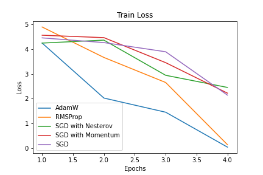
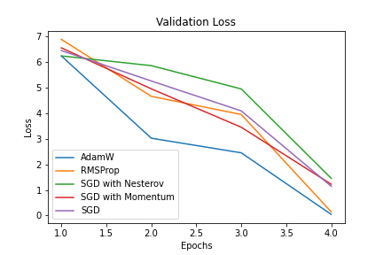

# Question Answering on the Conversation QA Dataset (CoQA)

## Data:

CoQA is a large-scale dataset for building Conversational Question Answering systems. The goal of the CoQA challenge is to measure the ability of machines to understand a text passage and answer a series of interconnected questions that appear in a conversation.

TCoQA contains 127,000+ questions with answers collected from 8000+ conversations. Each conversation is collected by pairing two crowdworkers to chat about a passage in the form of questions and answers.

The unique features of CoQA include

- 1. the questions are conversational;
- 2. the answers can be free-form text;
- 3. each answer also comes with an evidence subsequence highlighted in the passage; and
- 4. the passages are collected from seven diverse domains

## Experiments:

#### **DistilBERT**

- Training the model with an AdamW optimizer with learning rate of 5e-5 for 4 epochs, yielded an **F1 Score of 0.68**.

#### **BERT:**

- Training the model with an AdamW optimizer with learning rate of 5e-5 for 4 epochs yielded an **an F1 Score of 0.72**.

#### **RoBERTa**

- Training the model with an AdamW optimizer with learning rate of 5e-5, for 6 epochs yielded an **F1 Score of 0.84**.

A batch size of 8 was used to train all the models.

**Hyperparameter Tuning**

| Model      | F1 Score(Weighted) |
| ---------- | ------------------ |
| DistilBERT | 0.68               |
| BERT       | 0.72               |
| RoBERTa    | 0.84               |

**Training loss**

**Validation loss**

